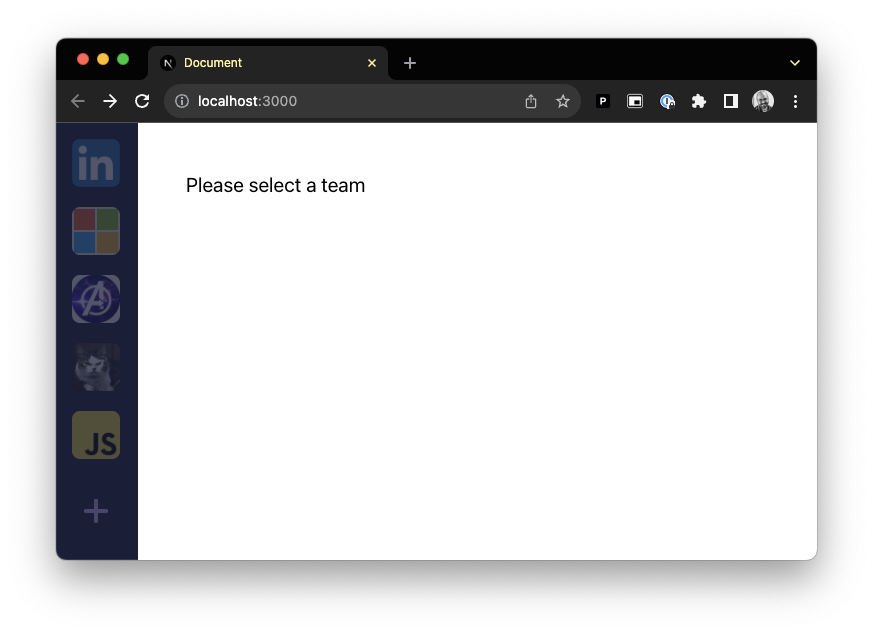

In this chapter, we'll follow steps 1, 2 and 3 as described in [the approach for converting large projects from JavaScript to TypeScript](../05-converting-to-ts/#an-overview-of-the-approach).

> 1. **Get TypeScript into your build toolchain**, type-checking your existing `.js` files, in the most permissive mode possible
> 1. **Rename some files from `.js` to `.ts`**, fixing only the things necessary to get the compile working
> 1. **Forbid implicit `any`s**, replacing them throughout the codebase with _explicit `any`s_, `{}`s or more descriptive types
>    - Improve error handling by enabling `useUnknownInCatchVariables` in tsconfig
>    - Install community-supported types from [DefinitelyTyped](https://github.com/DefinitelyTyped/DefinitelyTyped/) where necessary

## Getting started with the big project

Let's look back at our project git repo. We'll be working a little bit with the `packages/chat-stdlib` library we created earlier, and the main chat app in `packages/chat`.

From the root of the git repo, enter the folder

```sh
cd packages/chat
yarn dev
```

If this is your first time running the project, it may take a minute or two to build. Start the app up to make sure everything works properly. Look for the console output

```sh
 Serving on http://localhost:3000
```

This is an indication that the UI should be viewable on [http://localhost:3000](http://localhost:3000)

You should see something like this



## Type-checking JavaScript

To enable type-checking of JavaScript files, add the following line to the `compilerOptions` object in `packages/chat/tsconfig.json`

```json
"checkJs": true,
```

This project uses [`parcel`](https://parceljs.org/) to build and run the UI, which knows which parts of TypeScript syntax it can delete in order to arrive at JavaScript, but **it performs no type-checking**. To have TypeScript compile our project, you can run

```sh
yarn typecheck
```

You should see a couple of errors, all within the `src/` folder

```pre
Found 8 errors in 4 files.

Errors  Files
     1  src/index.js:8
     1  src/ui/App.jsx:22
     4  src/ui/components/Channel.jsx:19
     2  src/utils/networking.js:40
```

Go ahead and fix these. Some hints:

This comment

```js
/**
 * @type {React.FC<React.PropsWithChildren<any>>} param0 
 */
```

when added above any React function component will allow for an arbitrary props object, and a correctly-typed `children` property.

`React.useState()` defaults to a state type of `undefined`.

```js twoslash
// @checkJs
// @errors: 2339
// @types: react
const [list, setList] = React.useState()
//      ^?
if (list) list.length
//          ^?
```

 You can provide a type, by providing a default argument, _even if it has a possibility of being `null` or `undefined`_

```js twoslash
// @types: react
/**
 * @type {any[]}
 */
const initialList = null;
const [list, setList] = React.useState(initialList)
//      ^?
if (list) list.length
//         ^?
```

### Renaming from `.js` to `.ts`

This can be a bit tedious to do without tools, so I've written a script for you to invoke from within the `packages/chat` folder.

```sh
node scripts/rename-to-ts.mjs
```

I recommend making a git commit immediately after the rename (but not necessarily a PR) so that **git history is preserved**. Sometimes git is not perfect at understanding a rename _in combination with other changes_ in a single commit, and you end up with ultimately a deletion of the old file and an addition of a new one.

and don't forget to make this small change to [`/index.html`](/index.html)

```diff
--- a/index.html
+++ b/index.html
@@ -8,6 +8,6 @@
   </head>
   <body class="font-sans antialiased h-screen">
     <div id="appContainer" class="w-full h-full"></div>
-    <script src="src/index.js" type="text/javascript"></script>
+    <script src="src/index.ts" type="text/javascript"></script>
   </body>
 </html>
```

Keep running

```sh
yarn typecheck && yarn test
```

and fixing small things until both commands pass

## Forbidding implicit `any`s

Lets go to `packages/chat/tsconfig.json` and add the following option

```json
"noImplicitAny": true
```

Run

```sh
yarn typecheck
```

You might see

```pre
Found 51 errors in 18 files.
```

That's a lot of errors. This is a great opportunity to demonstrate how we can refine a sub-part of our project at a time. Create a new file `packages/chat/src/utils/tsconfig.json`.

```json
{
    "extends": "../../tsconfig.json",
    "compilerOptions": {
        "noImplicitAny": true
    },
    "include": ["."]
}
```

and typecheck again, but _just_ for the `src/utils` folder

```sh
yarn tsc -P src/utils
```

This should be much more approachable! Please fix all the type errors. Keep in mind that in a `.ts` file, the type information provided by JSDoc comments is ignored

Repeat the same procedure for the `src/data` and `src/ui` folders (in that order). You can move the inner `tsconfig.json` from folder to folder, safely.

Finally, delete this `tsconfig.json` and set the `"noImplicitAny": true` in `../chat/tsconfig.json`. Run

```sh
yarn typecheck
```

Fix any remaining errors in the `./tests` folder, and consider yourself done with step 3
