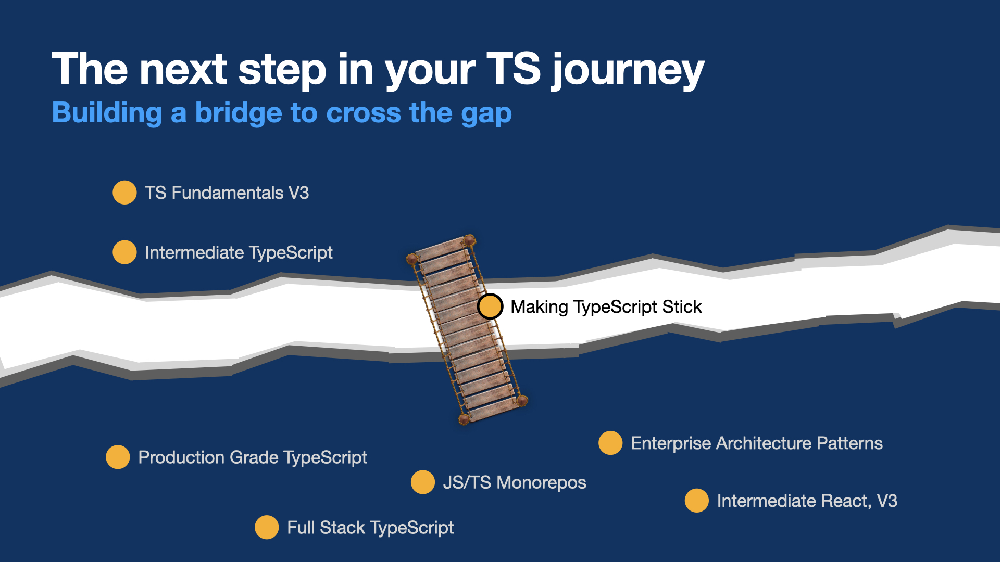
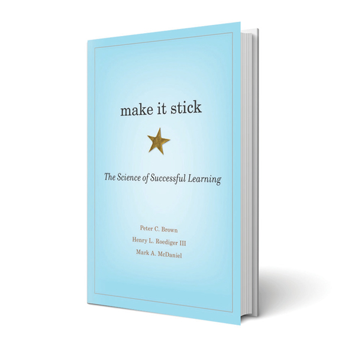

# What to expect

This course is a modernized version of a [practicum](https://en.wikipedia.org/wiki/Practicum).
Aside from a small update on the latest developments in the TS language,
**we won't be covering much _new material_, but we'll get a lot of valuable
practice** that will help you better retain knowledge and apply it to the
problems you encounter in the real world.

# But why practice?

Getting started with TypeScript is one thing, but there's a big gap between
learning the particulars of the language and practical application of the more
advanced topics that follow

# Inspiration

We'll be applying some of the techniques described in _Making it Stick_, a popular
book on the science of learning, retention, and application of learned knowledge.

How will we go about this? What makes this different from the _exercise portion_
of courses you may have already taken?

* We'll tackle some very challenging exercises. There's evidence in studies "desirable difficulty" in learning improves retention
* We'll learn in a bunch of different ways, and in a fairly non-linear way
* We'll balance between rule-driven and example driven learning approaches

# How to take this course

* If possible **space this course out over a few days or weeks**. There's some evidence that "spacing" improves retention by as much as 90% compared to "cramming".
* **Keep a journal as part of owning your learning path**. Be aware of which topics you still find challenging, and which ones you feel you've already mastered
* **Make sure that you actually participate in the exercises and challenges**. Active participation will greatly increase the benefit of this course in your ability to form a solid mental model around TypeScript.
* **Be kind to yourself**, and try to frame "wrong answers" as learning opportunities
